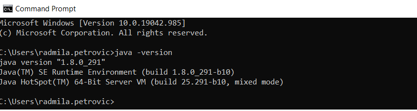
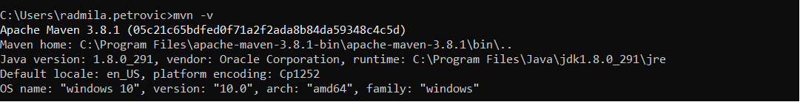
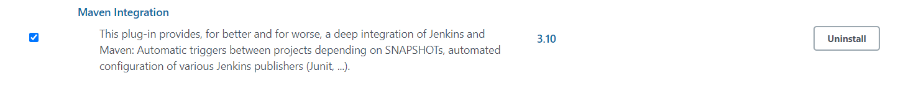
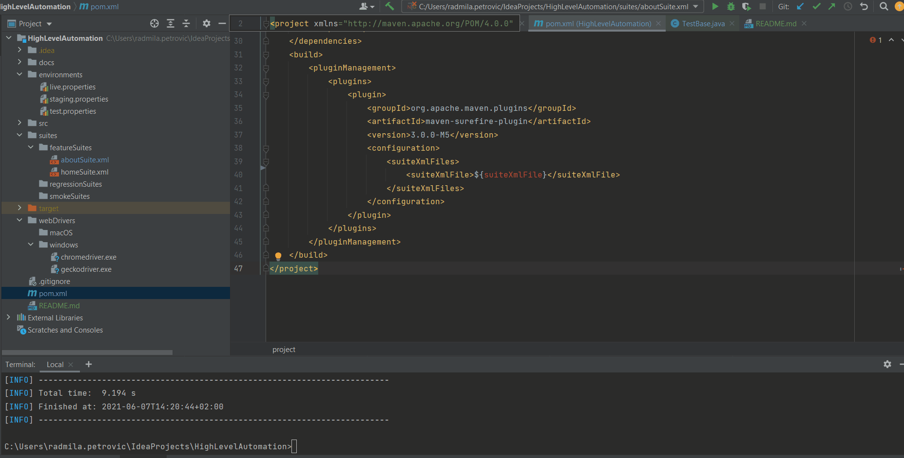

## Introduction
The purpose of this repository is to present the setup of effective UI test automation project having in mind environments where tests should be executed, operating system, browsers used and test suite organization.

## Stack
* Java - Jdk 1.8 
* Maven - Apache Maven 3.8.1
* Selenium Web Driver 3
* TestNG - 6.14.3
* Jenkins - 2.277.4

## Installation Guide

### Java
Java download link https://www.oracle.com/java/technologies/javase/javase-jdk8-downloads.html
To check installed java version type "java -version" in your terminal

For troubleshooting take a look at https://java.com/en/download/help/path.html

### Maven
Maven download link https://maven.apache.org/download.cgi
To check installed maven version type "mvn -v" in your terminal

For troubleshooting take a look at https://www.baeldung.com/install-maven-on-windows-linux-mac

### Jenkins
Jenkins download link https://www.jenkins.io/download/
In order to execute maven job at Maven Plugin manager page install maven integration plugin

## Run test
